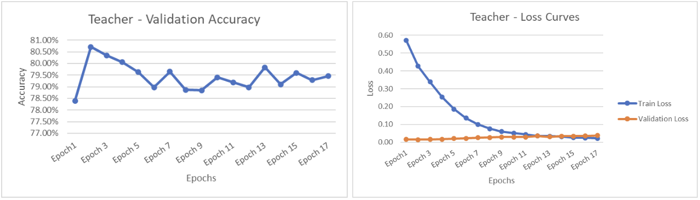
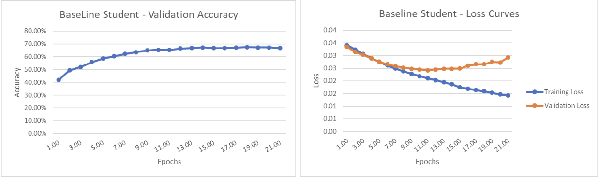
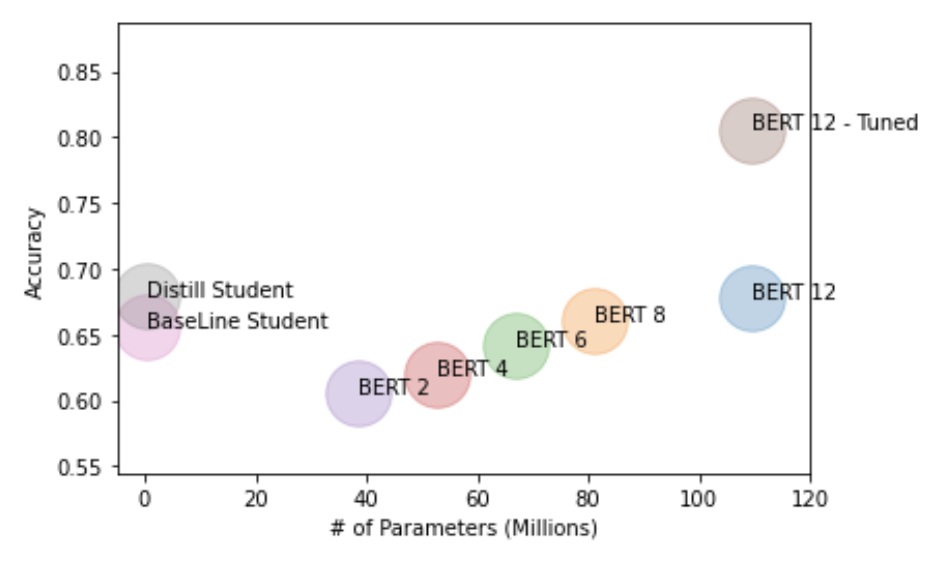
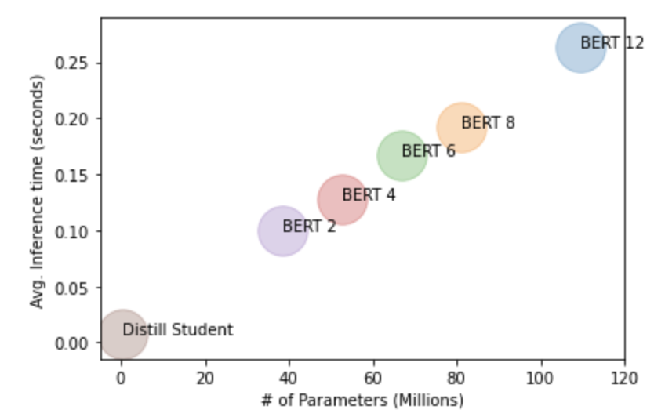

# BERT-Model-Distillation

In recent years, sudden increase in textual data from social media, e-commerce and other domains have made large scale text processing a necessity. Sentiment analysis is one of the ways companies are leveraging this available data to understand the reasons behind the people’s opinions about a product or a service. 

There are a lot of advanced models and algorithms that effectively classify text data based on the sentiment. But the major issue with these models is that they are very deep and complex, which in turn causes higher inference time and resource utilization. With the current trend of larger models being trained on an increasing number of parameters, the size complexity and inference time of the models are likely to go up.

Our research majorly focuses on 2 aspects: 
1. Using knowledge distillation in large NLP models, where we use student-teacher learning to condense a 12 layer Bert model with 110 million parameters that we tuned for sentiment classification, into a smaller Bi-directional LSTM model.
2. Deploying this distilled model to the server and reducing the inference time.

Teacher Model: BERT 12, Student Model: BiLSTM Model, Distilled Model: BiLSTM Model

## Results:
Models were trained in P3.2xlarge and deployed on t3.xlarge on EC2 instance

     

Observations:
1. As expected the Distilled student model trained using Knowledge distillation had higher accuracy when compared to the baseline student model.( 67.9% vs 65.6%)
2. The student had a ~4% increase in accuracy after knowledge distillation.
3. The inference time are equal for both the distill student and baseline student (same number of parameters).
4. The load balancer did not give us the improvement we expected but it would’ve been useful if our application had a larger scale than our current implementation as then the inference time would be higher

